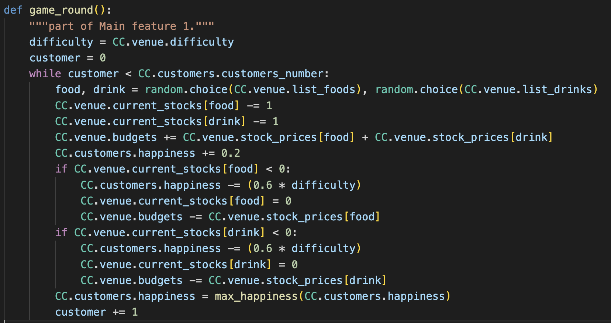
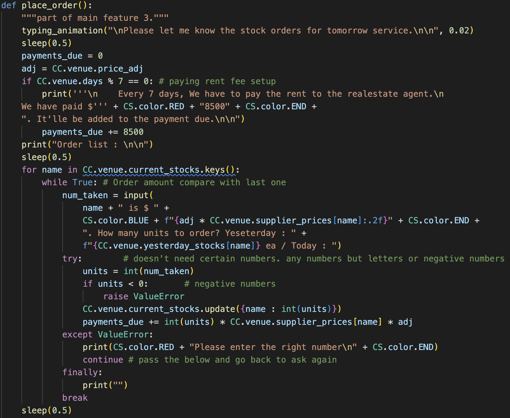
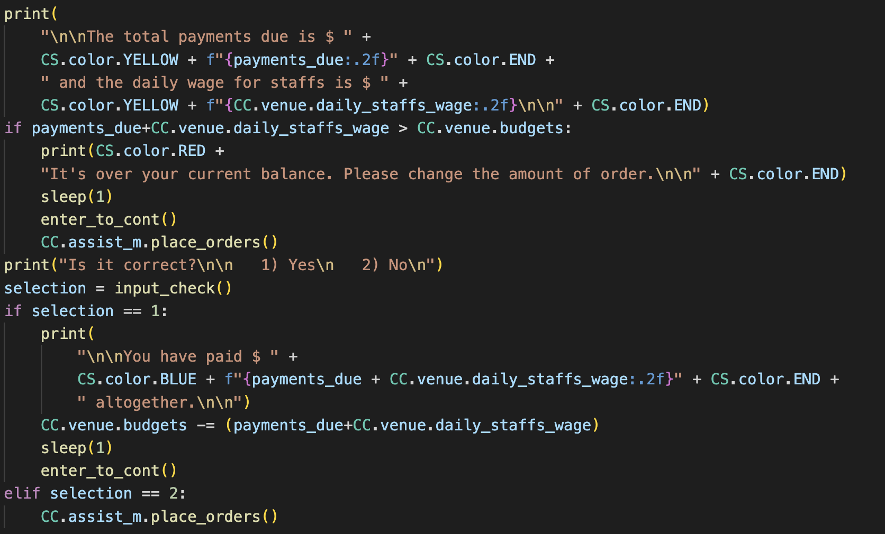
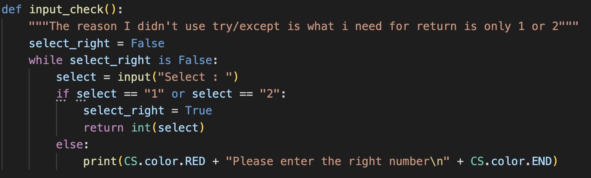

# T1A3 Terminal Application 
## by Chang-Ha Lee

----------------------------------------------------------------

## [Video Presentation](https://vimeo.com/manage/videos/743882385)

## [GitHub Repo](https://github.com/RyanWoolf/ChanghaLee_T1A3)

## [Trello workspace](https://trello.com/invite/b/G1Wv3lMa/8b65415f531a27a81e285678057ff906/lionwolf-haus-project)

----------------------------------------------------------------

# LionWolf Haus 
### - Restaurant Tycoon -

## Introduction

LionWolf haus - Restaurant tycoon - is a bash terminal-based game running a restaurant through Stock order, selling and earning, maintaining Customer Happiness. It's inspired by my childhood game "**Fastfood**" from **gamania**. Basically Similar game play style but has more detail features such as choosing the location of the venue getting different number pax of customers or upgrade the building of the venue. 

Player will have to prepare the service to look after certain number of customers changing each day by maintaining the venue budget, Wastage rate and Customer Happiness. Unexpected accidents might occur through business operations, Player can choose what to do for fixing problems and will see the result of choice. It takes users proper input to take numbers to order or selection of choice and then program will calculate how much payment due you'd have to pay or what result you'd get from your choice such as higher or lower Customer Happiness, Budget that the venue owns, Wastage rate and even a fine. If you can't manage the venue following the rules, you'll lose. 

Try your managing skills in LionWolf Haus as many days as you can and check how many days you can keep the restaurant having profits!

## Functionality and features

1. [Main] Trading - Selling products to customers and receive the payment

Alpha and Omega of this game. This is the major main feature that makes the entire concept work. 
Stocks dict consists of key is the name of product, value is the actual number of stock that player ordered last day will be traded with money which is stored in Venues instance attribute and Happiness which in in Customers instance attribute. In real world, Customer has money and pay to the venue, but in the program, where is the money coming from is not important. Simply Customer(class) has self attribute "Happiness" getting high unless the stock is run out. 

Based on "while" loop to have each customer choose randomly of food and drink via `random.choice()` method then followed by update the number of stock from the current stock dict and add each prices of items to the attribute "budgets" in Venue instance then Customers get more happiness. 
But there is a problem. What if the stock is run out? It'd be similar situation like in the real world, Customers will get money back and lose Happiness. Also the stock cannot be negative numbers so it goes back to `int 0`. 

At the second line from the bottom, Function that will control the max number of Happiness because Happiness is a number described in percentage, so it can't be more than 100.

2. [Main] Accidents occur through the service hours

In real world, Trading is happening through the service hours. It's too obvious because things can happens at the same time together. Unfortunately in programming, due to Interpreter will read the code one line by line, codes can't be executed at the exact same time. But what we can do instead is to make it looks like happens at the same time even though they're executed one by one. So the mechanism to make that happen is to execute Trading first which'll take only a second or two(which means the program knows how much money we earned, how much happiness we lost already), then execute counting hours which will make it look like Trading is executing through the hours. 

Chances based on Random numbers. Due to time is iterating 7 times, Random numbers for accidents get decided 7 times. For example, long_wait has only 2% chance of happening but it iterates 7 times altogether which makes it 14% chance during a day. Each events have different options followed by different result. And, of course, if the random number doesn't match in any case, nothing will happen during counting hours.

3. [Main] Daily stock order

Placing stock order is very similar mechanism as Trading. You store a number from input then multiply by price from the dict has price list then append it to the payments due variable. Interesting thing here is there's 2 kinds of error handling used. First one is `try/except` statement. It's used in the part of taking number for stock order from user input. Because we need any numbers from user, if the string received from user input can't be casted to integer, it'll occur ValueError leads except statement, then continue statement which can make it ignore the rest of code then go back to while loop where it started from until the error not happening. If there was no ValueError happened, the while loop will break through break statement. That makes user have to put numbers only not strings. Plus we need positive numbers only so if the input casted to negative numbers, it'll `raise` ValueError so that it can go back to taking input again.

The second error handling is via while loop. In this case though, We need only 2 result back which is yes(1) or no(2). The loop will keep happening until the condition is True which makes by checking the input result is "1" or "2". This time we don't need to check whether it's string, float or even negative numbers because we want to see that player enter 1 or 2.

## Implementation Plan

## Coding style guide line

PEP 8 from [here](https://peps.python.org/pep-0008/)

## Install and Run guide

Please visit [here](./docs/help.md)

## Referenced source code

**Art v5.7** , ASCII Art Library for Python, from [here](https://pypi.org/project/art/https://pypi.org/project/art/)

**Typing_animation** function from [here](https://stackoverflow.com/questions/20302331/typing-effect-in-python)

**Text colour** class from [here](https://www.delftstack.com/ko/howto/python/python-bold-text/)
